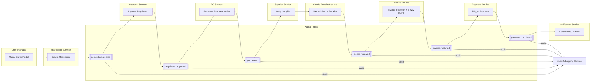
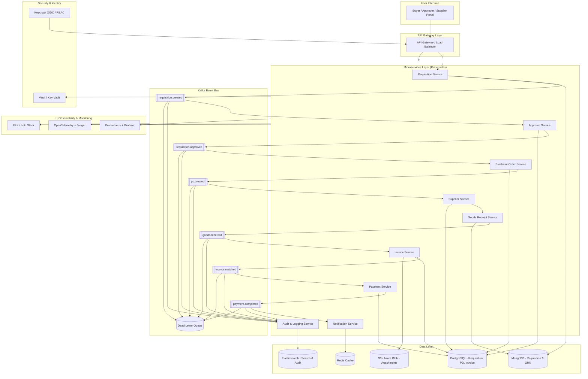

# Procure-to-Pay (P2P) Microservices Architecture — Scalable for 100K Concurrent Users

## 1. Overview — Procure-to-Pay Workflow

**Procure-to-Pay (P2P)** process flow:
1. **Requisition Creation** → user requests goods/services  
2. **Approval Workflow** → manager or budget holder approves  
3. **Purchase Order (PO)** → generated & sent to supplier  
4. **Goods Receipt (GRN)** → confirms goods/services delivered  
5. **Invoice Processing** → supplier submits invoice  
6. **3-Way Match** → PO + GRN + Invoice validation  
7. **Payment Processing** → finance initiates payment  

---

## 2. Microservices Architecture

Each service owns its own database (polyglot persistence), and communicates via **Kafka (event-driven)** or **gRPC/REST (synchronous)**.

| Service | Responsibility | Key Tech Stack | Database |
|----------|----------------|----------------|-----------|
| **User Service** | Manage users, roles, org structure | Keycloak, NestJS/Go | PostgreSQL |
| **Requisition Service** | Create, edit, and submit requisitions | Spring Boot / FastAPI | MongoDB |
| **Approval Service** | Workflow engine for approvals | Camunda / Temporal | PostgreSQL |
| **Catalog Service** | Manage items, pricing, supplier catalogs | Node.js / Go | Elasticsearch / Redis |
| **Supplier Service** | Supplier onboarding, status, contracts | NestJS / Java | PostgreSQL |
| **PO Service** | Convert requisition → PO, manage lifecycle | Spring Boot / .NET | PostgreSQL |
| **Goods Receipt Service** | Record delivery, quantity checks | Java / Go | MongoDB |
| **Invoice Service** | Invoice ingestion, OCR, 3-way matching | Python / Java | PostgreSQL |
| **Payment Service** | Trigger and reconcile payments | Java / Go | PostgreSQL |
| **Notification Service** | Email/SMS/Slack/Webhooks | Node.js | Redis / Kafka |
| **Audit & Logging Service** | Track all changes | Fluentd / ELK | Elasticsearch |

---

## 3. Event-Driven Flow (Using Kafka)

### Topics and Events

| Event Topic | Produced By | Consumed By |
|--------------|--------------|-------------|
| `requisition.created` | Requisition Service | Approval Service, Audit Service |
| `requisition.approved` | Approval Service | PO Service |
| `po.created` | PO Service | Supplier Service, Notification Service |
| `goods.received` | Goods Receipt Service | Invoice Service |
| `invoice.matched` | Invoice Service | Payment Service |
| `payment.completed` | Payment Service | Audit, Notification |

Each event is immutable, and consumers update their local state asynchronously → achieving **eventual consistency**.

---

## 4. Scalability & Concurrency Design

| Layer | Scaling Strategy |
|--------|------------------|
| **API Gateway** | NGINX / Kong / Azure API Management with autoscaling |
| **Services** | Kubernetes HPA based on CPU + message queue lag |
| **Kafka** | Multi-broker cluster (3–5 brokers), partitioning by `org_id` or `requisition_id` |
| **Databases** | Read replicas, connection pooling (PgBouncer), sharding if needed |
| **Cache Layer** | Redis for hot lookups and rate limiting |
| **Search** | Elasticsearch or OpenSearch for fast queries on requisitions/POs |
| **File Storage** | S3 / Azure Blob for invoices, attachments |
| **Async Ops** | Kafka + Dead Letter Queue for fault recovery |

---

## 5. Security & Compliance

- **Authentication**: Keycloak (OIDC, SSO)
- **Authorization**: Role-Based Access Control (RBAC)
- **Auditing**: All events persisted in `audit_log` service
- **Encryption**: TLS in transit, AES-256 at rest
- **Compliance**: GDPR / SOC2 / ISO 27001-ready logs & traceability

---

## 6. Performance for 100K Concurrent Users

| Area | Design Consideration |
|-------|-----------------------|
| **Read-heavy services** | Use Redis cache + Elasticsearch for catalog & PO searches |
| **Write-heavy services** | Use Kafka to offload synchronous pressure |
| **Horizontal scaling** | Kubernetes autoscaling per workload |
| **Database** | Use read replicas and partitioning |
| **API Layer** | Rate limiting per tenant / user |
| **Async events** | Kafka Streams for enrichment and matching logic |

---

## 7. Sample Data Flow

**Example: Requisition → PO → Payment**

```css
[User UI] 
   ↓ (REST/gRPC)
[Requisition Service] → emits → `requisition.created`
   ↓
[Approval Service] → emits → `requisition.approved`
   ↓
[PO Service] → emits → `po.created`
   ↓
[Supplier Service] notified
   ↓
[Goods Receipt Service] → emits → `goods.received`
   ↓
[Invoice Service] → performs → 3-way match → emits → `invoice.matched`
   ↓
[Payment Service] → triggers → payment → emits `payment.completed`
   ↓
[Notification Service] → sends confirmation
```

## 8. Observability

- **Metrics**: Prometheus + Grafana  
- **Tracing**: OpenTelemetry + Jaeger  
- **Logs**: ELK or Loki stack  
- **Alerting**: PagerDuty / Opsgenie  

---

## 9. Deployment Setup

- **Container Orchestration**: Kubernetes (AKS, EKS, GKE)
- **CI/CD**: GitHub Actions / Azure DevOps
- **Secrets Management**: HashiCorp Vault / Azure Key Vault
- **Environments**: Dev → QA → Staging → Prod

---

## 10. Technology Stack Summary

| Layer | Suggested Tech |
|--------|----------------|
| API Gateway | Kong / NGINX / Azure API Mgmt |
| Event Bus | Kafka / Azure Event Hub |
| Workflow | Temporal / Camunda |
| Databases | PostgreSQL, MongoDB |
| Caching | Redis |
| Search | Elasticsearch / OpenSearch |
| Message Consumers | Kafka Streams / Faust / Spring Cloud Stream |
| Container Orchestration | Kubernetes |
| Auth | Keycloak |
| Monitoring | Prometheus + Grafana |

---

## Summary

This architecture enables:
- **Massive concurrency (100K+)**
- **Event-driven processing**
- **Loose coupling between services**
- **Elastic scaling with Kubernetes**
- **Auditable and secure transactions**

---

## Procure-to-Pay — Event Flow (Mermaid Diagram)



## Procure-to-Pay — End-to-End Architecture & Event Flow (Mermaid Diagram)


