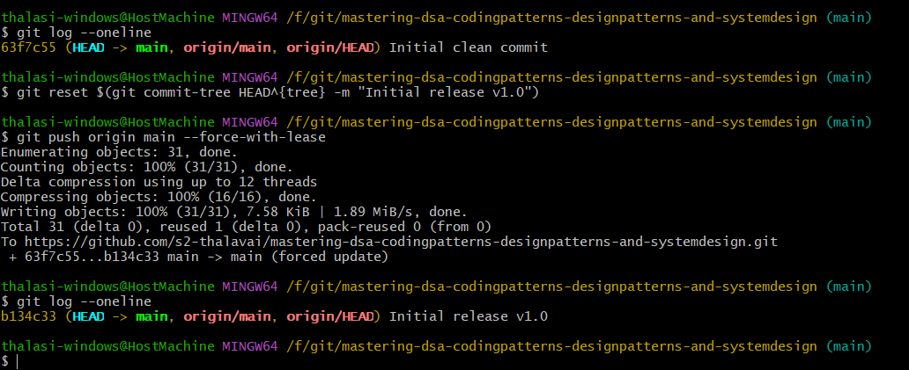

# git

squash everything on the branch into one commit

If you don’t care about intermediate commits (even if you’re not sure how many there are):

```git
git reset $(git commit-tree HEAD^{tree} -m "Final clean commit")
git push origin main --force-with-lease
```

That will merge all commits into a single commit, guaranteed — no need to count.



